# Unified-Machine-Learning-Tool
This project uses the the retraining script for CNN in Tensorflow by Google. This project creates a GUI for these scripts, the projects let's the user use the GUI to set parameters to the retraining script or use it without any changes for simple use.
  
The Project is aimed to simplify the process of training a Convolutional Neural Network via TensorFlow libraries and scripts and test it to check for proper responses. The Software implements the transfer learning method implemented in TensorFlow which uses a pre-trained TensorFlow models named ‘Inception Model’ and ‘Mobilenet SSD V2 Model’ and retrains the last layer of the model to recognize the user defined data set, this leads to a quick training of the model. And aims to simplify the testing of mobile models by implementing a way to test multiple test files at once and show the results in a tabular form with success rate information.
 
To increase the model’s ability to recognize a particular person, the project offers a high face accuracy mode which scans each image from selected datasets for faces and adds it to the existing dataset. This ensures that the model can recognize a person with only the person’s face in the frame and with person’s whole body in the frame. The accuracy is also increase by performing some random manipulations on the images of the dataset. The image manipulation consists of resizing the images to simulate the size of the object in the frame, rotating the image to simulate object being in an angle with the frame and flipping the image to simulate the object being mirrored in the frame.
 
The project also provides the user with an option of testing the model as well. The testing of model can be done in two ways in Single File Testing mode and Batch Testing mode, as the name suggest in Single File Testing mode the model can be tested against a single image file whereas in the Batch Testing mode the tool tests the model against multiple files and outputs the result in a tabular form. 
 
The project also gives the user to customize their model and the way the model is being trained with the Pro Mode. The Training of a good CNN Machine Learning model depends on many different factors such as Number of Training Steps, Training Batch Size, Validation Batch Size, Learning Rate etc. All the above-mentioned factors and more are available to user to change and perfect their model according to their preference in the Pro Mode. Moreover, the user is also able to customize some more aspects of the model such as Final Layer name according to their preference. With all these customization, simple testing models is difficult so, the tool also features Pro Mode in testing to be able to test the custom models as well.
 
The tool comes with eight major modes, namely:
- Normal Mode
- High Face Accuracy Mode
- Single Testing
- Batch Testing
- Mobile Mode
- Mobile High Face Accuracy Mode
- Mobile Single Testing
- Mobile Batch Testing Mode

### Normal Mode
In Normal Mode, the user just has to enter the Dataset Directory and the destination directory where the model and the label file will be stored. After the user clicks on Train, the tool turns to Randomize Data Module if enabled it performs Random Image Manipulations on data set as discussed above. This is followed by Pro Mode Settings in which if settings are set are passed onto the python retraining script, that trains the data, along with the above-mentioned directories else default settings are passed. The python script is run as a command line script and is run on a different thread than tool so that the tool UI does not become unresponsive while the training is going on.
 
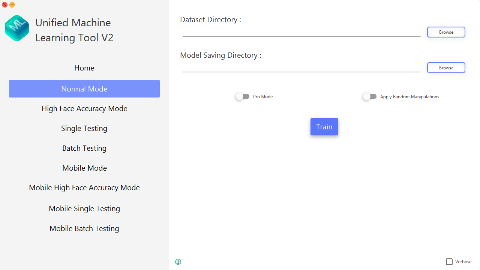

### High Face Accuracy Mode
In High Face Accuracy Mode, the user just must enter the Dataset Directory and the destination directory where the model and the label file will be stored. This information is passed onto Dataset Discovery Module which checks what datasets are there in directory and displays it to the user. The user must select the datasets to perform face detection on. These datasets are passed onto the Face Processing Module in which, each image is scanned for face and is stored in the corresponding dataset increasing the dataset, which would later on increase the ability of model to recognize a particular person, after face detection the tool moves to Randomize Data Module and the tool moves on as mentioned above in Normal Mode.
 
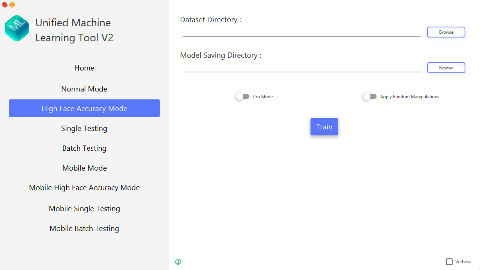
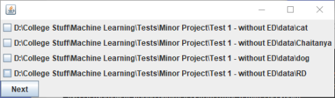

### Single Testing Mode
In Single Testing, the user enters the file to be tested against the model along with model file, label file and the minimum passing confidence. Upon the click of Test Button this information along with Pro Mode settings, if enabled, is passed onto the label image python script which then runs a recognition on the image and returns the result to the user. The python script is run as a command line script and is ran on a separate thread as to avoid the tool becoming unresponsive while the script is running. The output from the script is then checked for correct recognition and if minimum confidence is met, if any of the condition fail the test is considered as fail. 
 
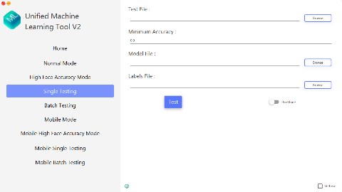

### Batch Testing Mode
In Batch Testing, the user enters the directory of the files to be tested along with the model file, label file and the minimum passing confidence. All this information is passed onto the Batch Testing Module, which discovers and tests each test file with the above-mentioned method in, Single Testing. The results are stored and upon the end of all tests the results are presented in a tabular manner which total success rate.
 
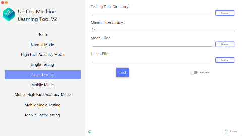

### Mobile Mode
Mobile Mode works same as the Normal Mode except, when Train Button is clicked the tool first checks if the computer is connected to internet, if connected it moves further and performs all the actions of Normal Mode, with an extra argument to the retrain python script which passes the URL of Mobilenet V2.
 
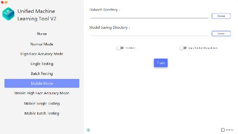

### Mobile High Face Accuracy Mode
Mobile High Face Accuracy Mode works same as the High Face Accuracy Mode except, when Train Button is clicked the tool first checks if the computer is connected to internet, if connected it moves further and performs all the actions of Normal Mode, with an extra argument to the retrain python script which passes the URL of Mobilenet V2.
 
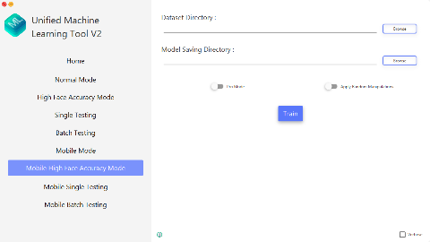

### Mobile Single Testing Mode
Mobile Single Testing works same as the Single Testing Mode except, upon the call of label image python script tool passes an extra argument which sets the image size for which a mobile model is trained for.
 
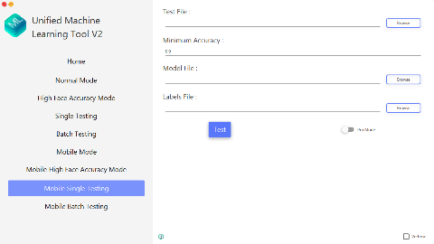

### Mobile Batch Testing Mode
Mobile Batch Testing works same as the Batch Testing Mode except, upon the call of label image python script tool passes an extra argument which sets the image size for which a mobile model is trained for.
 
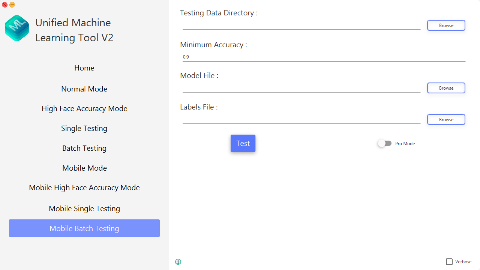

  
The tool also has three extra modes that work in conjunction with the major modes, these modes are:
- Pro Mode
- Randomize Data Mode
- Verbose Mode

### Pro Mode
In Pro Mode, the user can have a greater control over the model and how it is being trained. In this mode, the user can set settings like Number of Training Rounds, Training Batch Size etc. The user can also customize model by changing the final layer name according to their preference. With these customizations the testing of model is challenge as the models are not standardized therefore, corresponding Pro Mode settings can be set in testing mode as well. In testing Pro Mode, the user can change settings such as final layer name, input layer name, input image size etc.
 
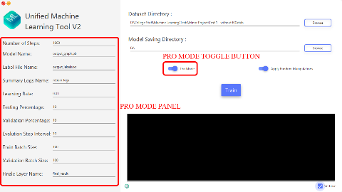
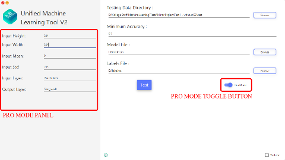

### Randomize Data Mode
In Randomize Data Mode, Manipulations such as resize, rotation and flipping of images are performed on training images. In this, the tool creates 5 randomly scaled resized images, 10 randomly rotated images (5 between 0 to 60 degrees and 5 between 300 to 360 degrees) and one flipped image, effectively increasing the dataset 17 times and increasing the model’s ability to recognize the object in non-ideal environments.
 
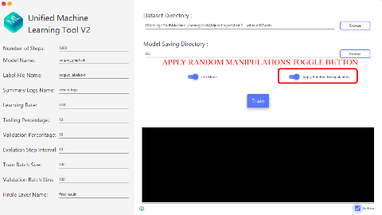

### Verbose Mode
Verbose Mode enables a verbose window where the user can see what is happening in the background in a delayed manner. Any error that occurs is also visible here.
 
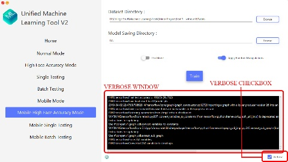

## Usage
### Steps to train a model with High Face Accuracy Mode with Pro Mode, Randomize Data and Verbose Mode.

#### Step 1:
- Put the all the pictures to be classified into one directory, for example all the pictures to be recognized as dog to be in a folder named dog.
- Put all these recognition folder in one folder.
- Set the Dataset Directory as this directory in the tool
- Set Model Saving Directory
- Enable Required modes
- Click Train

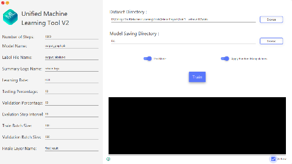

#### Step 2: 
- Select the directories to apply high face accuracy to.
- Click next

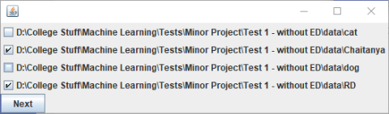
#### Done
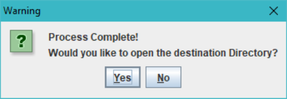

### Steps to Batch test a model with Pro Mode.

- Put all the testing images in one directory
- Rename the files as they would have to be recognized for example, 3 images of dog can be dog.jpg, dog1.jpg and dog2.jpg or dog.jpg, dog-1,jpg and dog-2.jpg or dog.jpg, dog (1).jpg and dog (2).jpg etc.
- Select this directory as Testign Data Directory
- Add Minimum conffidence / acuracy to consider it as a pass
- Select Model and Label Files
- Select Pro Mode or Verbose Mode as necessary
- Click Test

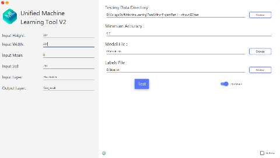
  
After this the testing will begin and the results will be shown in a tabular format with overall success rate.
 
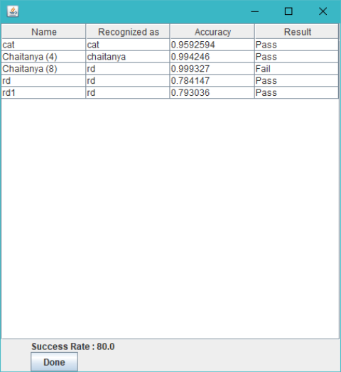

## Accompanied Research Paper
Link: [Unified Machine Learning Tool - Research Paper](http://ijsrd.com/Article.php?manuscript=IJSRDV7I50277)

## TensorFlow contributions
This application uses the retrain script from Tensorflow.
 
Link: [TensorFlow Retrain](https://github.com/tensorflow/hub/blob/master/LICENSE)

## License

